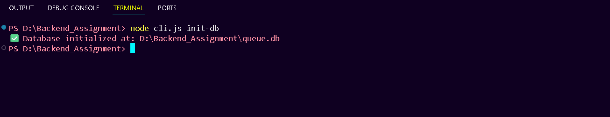
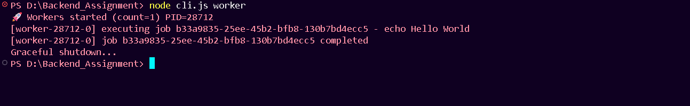

# QueueCTL – CLI Background Job Queue System

QueueCTL is a lightweight, CLI-based background job queue built with **Node.js** and **SQLite3**.  
It supports **parallel workers**, **automatic retries with exponential backoff**, and a **Dead Letter Queue (DLQ)** for permanently failed jobs.

---

## ⚙️ Tech Stack
- **Node.js (v22+)**
- **SQLite3** – for persistent job storage
- **Commander.js** – CLI interface
- **UUID** – for job IDs

---

## 🎯 Features
✅ Enqueue background jobs  
✅ Multiple worker support  
✅ Retry with exponential backoff  
✅ Persistent storage (SQLite)  
✅ Dead Letter Queue (DLQ)  
✅ Retry failed DLQ jobs  
✅ Graceful shutdown  
✅ PowerShell-safe CLI

---

## 🏗️ Architecture Overview

┌────────────┐
│ enqueue │───▶ jobs.db ──▶ workers pick jobs
└─────┬──────┘
│
▼
┌───────────────┐
│ Worker Thread │ executes → success → state=completed
│ │ executes → fail → retry (backoff)
└─────┬─────────┘
│
▼
retries > max_retries
│
▼
┌────────────┐
│ DLQ Table │ (failed jobs)
└────────────┘

🚀 Usage

1️⃣ Initialize the database
node cli.js init-db

2️⃣ Enqueue a job
node cli.js enqueue --command "echo Hello World"

3️⃣ Start worker(s)
node cli.js worker

4️⃣ View status
node cli.js status

5️⃣ List jobs by state
node cli.js list --state completed

6️⃣ View Dead Letter Queue
node cli.js dlq-list

7️⃣ Retry a DLQ job
node cli.js dlq-retry <jobId>

🔄 Retry & Backoff Logic
Each failed job retries automatically with exponential backoff:
delay = base ^ attempt  (in seconds)

Example (base = 2):

1st retry → 2s
2nd retry → 4s
3rd retry → moved to DLQ

🧩 Output ScreenShots

1️⃣ Initialize DB

2️⃣ Enqueue a Job

3️⃣ Worker Execution

🧪 Testing Checklist

✅ Successful job completes
✅ Failed job retries and moves to DLQ
✅ DLQ retry moves job back to pending
✅ Worker handles multiple jobs
✅ Data persists after restart
✅ Graceful shutdown verified

🧠 Assumptions & Design Decisions

Single-node processing (no distributed queue)
Uses SQLite for persistence
CLI-only interface (no web UI)
Focused on reliability and simplicity

👤 Author

Manish M Naik
Backend Developer Internship Assignment
November 2025

